# Sentriq AI-SOC: Faculty Demonstration & Viva Defense Guide

**Project Name:** Sentriq: Autonomous AI-Powered Security Operations Center (AI-SOC)  
**Academic Reference:** Major Project Evaluation & Faculty Viva Voce  
**Standards & PRD Alignment:** PRD Sections 1 to 27, NIST SP 800-61, MITRE ATT&CK Framework

---

## 1. Executive Demonstration Choreography (5–7 Minutes)

Follow this structured, click-by-click demonstration flow during your faculty evaluation.

```mermaid
graph LR
    A["1. Telemetry Dashboard (Live WS)"] --> B["2. Log Explorer (Raw Vectors)"]
    B --> C["3. ML Threat Workbench (RF Inference)"]
    C --> D["4. Explainable AI (SHAP Waterfall)"]
    D --> E["5. Incident Timeline (15m Sliding Window)"]
    E --> F["6. 4-Factor Risk Breakdown"]
    F --> G["7. Multi-Agent Triage (IOCs & Blast Radius)"]
    G --> H["8. HITL Response (Approve Firewall DROP)"]
    H --> I["9. Copilot & Executive Dossier Export"]
```

### Step 1: Real-Time SOC Telemetry Hub (`/dashboard`)
- **Action:** Open `http://localhost:5173/dashboard`.
- **What to show:**
  - Pulsating `● TELEMETRY: LIVE` connection indicator in the top control bar.
  - Live Alert Ticker Marquee displaying incoming events in real time.
  - Real-Time Area Chart animating incoming network event volume and threat spikes.
- **Talking Point:** *"Sentriq ingests high-velocity network telemetry over asynchronous WebSockets with real-time stream processing, avoiding static polling or page reloads."*

### Step 2: Log Explorer & Benchmark Telemetry (`/logs`)
- **Action:** Click **Security Logs** in the sidebar.
- **What to show:**
  - Paginated log table with Severity Badges, Protocol, and Source/Target IPs.
  - Click any event row to open the slide-over inspection drawer.
  - Expand the **Raw Feature Vectors (JSON)** tab to display authentic UNSW-NB15 flow features (`dur`, `sbytes`, `dbytes`, `sload`, `sttl`, `ct_dst_sport_ltm`).
- **Talking Point:** *"Every ingested event preserves raw flow feature vectors for forensic reproducibility, bridging low-level network packets to high-level threat semantics."*

### Step 3: Machine Learning Detection Engine (`/analysis`)
- **Action:** Click **Threat Analysis** in the sidebar.
- **What to show:**
  - Top Model Banner: Random Forest, **96.67% Accuracy**, **0.9669 F1-score**, 0.0% False Positive Rate.
  - Click the **"Brute Force Scenario"** preset button and click **"Run AI Threat Detection"**.
  - Review the instant `MALICIOUS` verdict, confidence gauge, probability distribution bar chart, and heuristic rule signals.
- **Talking Point:** *"Our ML pipeline pairs a binary threat classifier with a 6-class attack categorizer trained on authentic UNSW-NB15 benchmark telemetry, executing in under 12 milliseconds."*

### Step 4: Explainable AI (XAI) & SHAP Feature Attribution
- **Action:** In the Threat Analysis view, click **"Inspect Full SHAP Feature Attribution"**.
- **What to show:**
  - The **Horizontal Diverging Bar Chart**: Red bars pushing right representing attack contributors (e.g. elevated destination port frequency, anomalous connection rate), teal bars pushing left for baseline indicators.
  - Rule-to-XAI Bridge consensus check confirming heuristic rules and ML feature attribution agree.
- **Talking Point:** *"Rather than a black-box verdict, Sentriq implements SHAP TreeExplainer ($O(TLD^2)$ polynomial time) to mathematically prove why a packet sequence was flagged as malicious."*

### Step 5: Incident Timeline & 15-Minute Sliding Window (`/incidents`)
- **Action:** Click **Incidents** in the sidebar and select an active incident (e.g. `INC-2026-0001`).
- **What to show:**
  - Left column: **Correlated Attack Timeline** showing the chronological sequence of events with exact relative time deltas ($+0s$, $+14s$, $+45s$).
  - Show how 12 individual raw alerts were automatically clustered into a single unified incident.
- **Talking Point:** *"Sentriq's sliding-window correlation engine eliminates alert fatigue by over 90%, clustering sequential probe, brute force, and escalation signals into a coherent attack timeline."*

### Step 6: Transparent 4-Factor Risk Scoring
- **Action:** In the Incident Details view, inspect the right column card **Transparent Risk Scoring**.
- **What to show:**
  - Deterministic score (e.g. `86.5 / 100 [Critical]`).
  - Progress bars for all 4 factors:
    1. Severity (30% weight)
    2. ML Confidence (30% weight)
    3. Asset Importance (20% weight)
    4. Attack Impact (20% weight)
  - Factor Attribution Narrative text box explaining the calculation.
- **Talking Point:** *"Unlike opaque or hallucinated risk numbers, Sentriq uses a transparent, auditable mathematical formula that guarantees deterministic scoring across all enterprise assets."*

### Step 7: Autonomous Multi-Agent Investigation & IOC Extraction
- **Action:** View the **Autonomous Multi-Agent Investigation Dossier** card.
- **What to show:**
  - 4 Agent roles: Triage Agent, Correlation Agent, Response Agent, Reporting Agent.
  - Attack Entry Vector banner (e.g. *"Remote Credential Brute-Force against identity 'admin' on port 22 originating from 198.51.100.45"*).
  - MITRE ATT&CK technique mapping (`TA0006`, `T1110`).
  - Extracted Indicators of Compromise (IOC) table with one-click copy buttons.
- **Talking Point:** *"Our multi-agent pipeline extracts attacker IOCs, evaluates MITRE tactics, and determines enterprise blast radius across subnets."*

### Step 8: Human-in-the-Loop Response Actions (PRD FR-10)
- **Action:** Scroll to the **Containment & Remediation Playbooks** card.
- **What to show:**
  - Actions in **Pending** status with pulsating amber badges.
  - Copyable shell command: `iptables -I INPUT 1 -s 198.51.100.45 -j DROP`.
  - Type an audit comment (e.g. *"Confirmed adversary origin, verified with network lead."*) and click **"Approve & Apply"**.
  - Notice status instantly changes to `APPROVED & ENFORCED` with timestamp and analyst name.
- **Talking Point:** *"In strict accordance with PRD FR-10 and NIST guidelines, destructive containment measures are never auto-executed; Sentriq enforces strict Human-in-the-Loop review."*

### Step 9: Zero-Hallucination Copilot & Executive Dossier Export
- **Action:**
  - Click **"AI Copilot"** in the top action bar. Ask: *"What is the attack entry vector?"* Show grounded answer, citations, and suggested follow-ups.
  - Click **"Dossier"** in the top action bar. Preview the markdown report and click **"Download .md"**.
- **Talking Point:** *"The SOC Copilot answers strictly from PostgreSQL database records with zero hallucination, generating compliance-ready executive dossiers in one click."*

---

## 2. Anticipated Faculty Viva Voce Questions & Model Answers

### Q1: Why did you choose Random Forest instead of Deep Learning (LSTM, CNN) or an LLM for threat detection?
> **Answer:** 
> 1. **Ultra-Low Latency:** In a production SOC, packet streams arrive at thousands of events per second. Our Random Forest evaluates feature vectors in **11.9 ms** (~84 events/sec on a single CPU core), whereas deep neural networks or LLMs require GPU acceleration and introduce latency of 200–2,000 ms.
> 2. **Exact Mathematical Explainability:** Random Forest allows exact polynomial-time Shapley value computation via SHAP `TreeExplainer` ($O(TLD^2)$), providing deterministic feature attribution without approximation errors.
> 3. **Zero Hallucination:** LLMs are prone to hallucinating non-existent CVEs or IP addresses. We deliberately constrain ML models to statistical detection and use agentic LLMs strictly for synthesizing verified database facts.

### Q2: How does Sentriq guarantee zero hallucination in the SOC Copilot?
> **Answer:** 
> Sentriq uses a **Grounded Retrieval-Augmented Architecture**. When an analyst queries the Copilot, the backend queries PostgreSQL for exact event timestamps, source IPs, target assets, and SHAP factor weights. The agent constructs responses strictly constrained to these verified database facts and provides explicit citations (Event IDs, IP timestamps). If an indicator does not exist in the database, the Copilot explicitly states that no telemetry exists rather than fabricating details.

### Q3: How does the sliding-window correlation engine work, and how does it prevent alert fatigue?
> **Answer:** 
> Traditional SIEMs trigger an alert for every single failed packet, producing thousands of disconnected notifications. Sentriq maintains a **15-minute sliding temporal window**. When a suspicious event arrives, the engine queries active incidents matching the source IP or target asset within the time window. If a match exists, it appends the event, updates the chronological attack timeline, and recalculates the risk score. In our benchmark evaluation, this reduced raw alert volume by **93.3%** (e.g. 120 raw alerts clustered into 8 structured incidents).

### Q4: What makes your risk scoring transparent compared to commercial tools?
> **Answer:** 
> Most commercial SIEMs use proprietary, opaque algorithms ("Risk: 87") with no mathematical audit trail. Sentriq implements the PRD Section 13 deterministic 4-factor formula:
> $$\text{Risk Score} = 0.30 \times \text{Severity} + 0.30 \times \text{ML Confidence} + 0.20 \times \text{Asset Importance} + 0.20 \times \text{Attack Impact}$$
> Every incident detail screen visually displays the exact contribution of each factor along with a natural language narrative explaining why that score was reached.

### Q5: How is data managed and persisted with Docker Desktop?
> **Answer:** 
> PostgreSQL 16 runs in an isolated Docker container (`sentriq-postgres`) with data mapped to a persistent named Docker volume (`sentriq_pgdata`). Even when containers are stopped, restarted, or updated, all telemetry events, incident timelines, and analyst audit logs remain completely preserved.

---

## 3. Academic Benchmark Performance Reference

| Metric | Target (PRD Sec 21) | Empirical Result | Status |
|:---|:---|:---|:---|
| **Binary Detection Accuracy** | $\ge 90.0\%$ | **96.67%** | **Exceeded** |
| **Binary Weighted F1-Score** | $\ge 0.880$ | **0.9669** | **Exceeded** |
| **False Positive Rate (FPR)** | $< 5.0\%$ | **0.00%** | **Exceeded (Zero FPs)** |
| **Multi-Class Accuracy** | $\ge 85.0\%$ | **96.67%** | **Exceeded** |
| **Mean Inference Latency** | $< 25.0\text{ ms}$ | **11.94 ms** | **Exceeded** |
| **Alert Noise Reduction** | $\ge 70.0\%$ | **93.3%** | **Exceeded** |

---
*Prepared for the Sentriq AI-SOC Major Project Examination Committee.*

