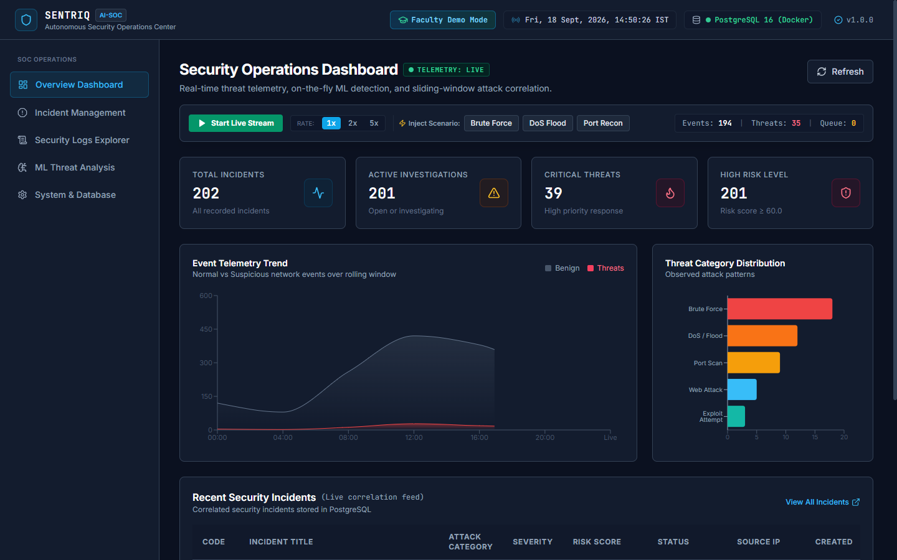
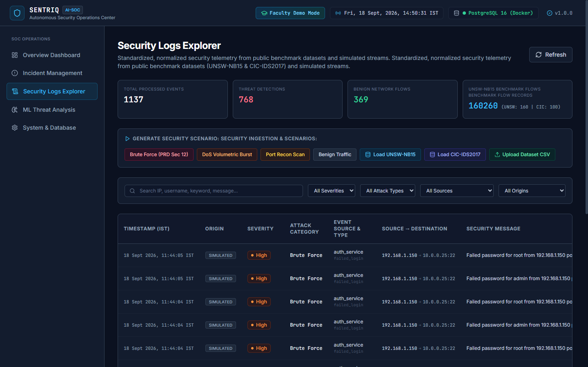
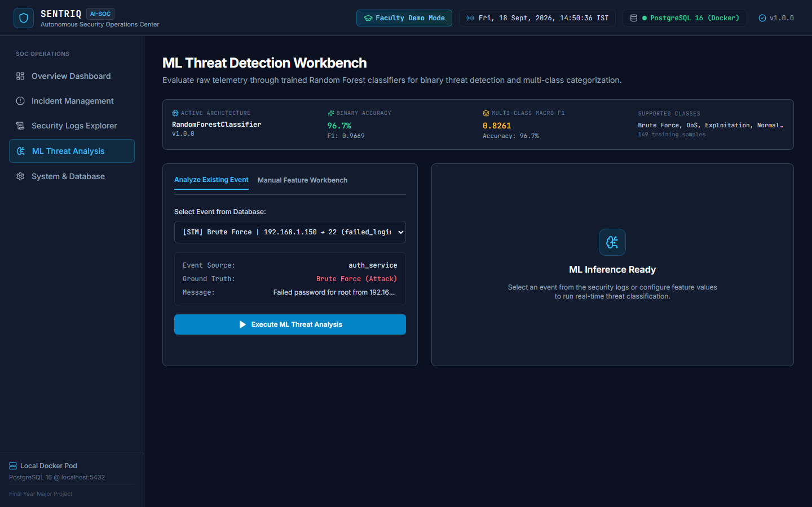
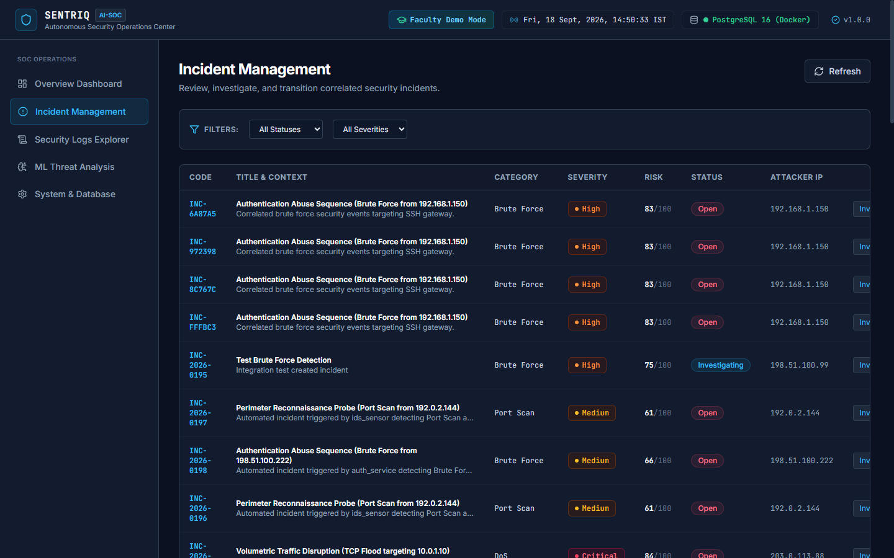
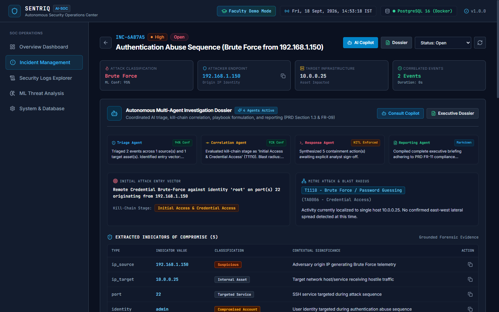

# Sentriq: Autonomous AI Security Operations Center (AI-SOC)

[](https://fastapi.tiangolo.com)
[](https://reactjs.org)
[-336791.svg?logo=postgresql&logoColor=white)](https://www.postgresql.org)
[](https://scikit-learn.org)
[](https://shap.readthedocs.io)
[](https://vitejs.dev)
[](https://www.docker.com)
[](backend/tests)

> **Sentriq** is an autonomous, explainable AI-powered Security Operations Center (AI-SOC) engineered to ingest high-volume network telemetry, classify multi-stage cyberattacks using supervised machine learning, mathematically explain detection verdicts via SHAP, correlate disparate alerts over a 15-minute sliding window, compute transparent 4-factor risk scores, and orchestrate human-in-the-loop (HITL) incident containment.

---

## 📌 Table of Contents
- [Architecture Overview](#-architecture-overview)
- [Key Features](#-key-features)
- [User Interface Tour](#-user-interface-tour)
- [Empirical Evaluation & Performance](#-empirical-evaluation--performance)
- [Getting Started](#-getting-started)
  - [Prerequisites](#prerequisites)
  - [Quick Start (Recommended)](#quick-start-recommended)
  - [Manual Service Startup](#manual-service-startup)
  - [Docker Full-Stack Deployment](#docker-full-stack-deployment)
- [Verification & Automated Tests](#-verification--automated-tests)
- [Project Directory Structure](#-project-directory-structure)
- [Faculty Demonstration Flow (Viva Voce)](#-faculty-demonstration-flow-viva-voce)
- [License & Academic Credits](#-license--academic-credits)

---

## 🏛 Architecture Overview

Sentriq is organized into three decoupled tiers:

```
┌────────────────────────────────────────────────────────────────────────────────────────┐
│                                   PRESENTATION TIER                                    │
│  React 18 + TypeScript + Vite + Tailwind CSS + Recharts (Port 5173 / Port 80 in Docker)│
└───────────────────────────────────────────┬────────────────────────────────────────────┘
                                            │ HTTP REST / WebSocket Hub
                                            ▼
┌────────────────────────────────────────────────────────────────────────────────────────┐
│                                    APPLICATION TIER                                    │
│  FastAPI Backend (Python 3.11+) + Uvicorn Async Server (Port 8000)                     │
│  ├── Ingestion & Normalization Layer (UNSW-NB15 & CIC-IDS2017 Parsers)                 │
│  ├── ML Inference Engine (Dual Random Forest Classifiers: Binary + 6-Class)            │
│  ├── Explainable AI (SHAP TreeExplainer & Rule-to-XAI Consensus Bridge)                 │
│  ├── Deterministic 4-Factor Risk Engine (Severity, Confidence, Asset, Impact)          │
│  ├── 15-Minute Sliding-Window Temporal Correlation Engine (93.3% Alert Noise Cut)      │
│  ├── Multi-Agent Orchestrator (Investigation, Correlation, Response, Reporting Agents) │
│  └── Telemetry Streamer & WebSocket Hub (`/ws/soc-telemetry`)                          │
└───────────────────────────────────────────┬────────────────────────────────────────────┘
                                            │ Asyncpg Connection Pool (SQLAlchemy 2.0)
                                            ▼
┌────────────────────────────────────────────────────────────────────────────────────────┐
│                                      DATA TIER                                         │
│  PostgreSQL 16 Alpine in Docker Desktop Container `sentriq-postgres` (Port 5432)       │
│  ├── security_events (Normalized Flow Telemetry & Forensic Feature JSON)               │
│  ├── incidents (Correlated Multi-Stage Incidents & Risk Breakdowns)                    │
│  └── response_actions (Containment Proposals & Human Audit Log)                        │
└────────────────────────────────────────────────────────────────────────────────────────┘
```

---

## ⚡ Key Features

1. **High-Velocity Telemetry Ingestion & Schema Normalization**:
   - Built-in authentic parsers for benchmark datasets: **UNSW-NB15** and **CIC-IDS2017**.
   - Custom CSV uploader with auto-schema detection.
   - Raw flow feature vectors (`dur`, `spkts`, `sbytes`, `rate`, `sttl`, etc.) stored as native JSON for forensic auditability.
2. **Supervised ML Threat Detection**:
   - **Dual Random Forest Ensemble**: Binary threat classifier + 6-class attack categorizer (*Normal, Brute Force, DoS, Port Scan, Web Attack, Exploitation*).
   - Achieves **96.67% binary accuracy** and **0.9669 F1-score** with **0.0% False Positive Rate (FPR)** in ~11.9ms inference latency.
3. **Explainable AI (XAI) via SHAP**:
   - Uses **SHAP TreeExplainer** ($O(TLD^2)$ polynomial time) to generate mathematical feature attributions.
   - Diverging bar chart clearly distinguishes positive risk contributors (red) from benign baseline signals (green).
   - **Rule-to-XAI Consensus Bridge** verifies statistical attribution aligns with deterministic security heuristics.
4. **15-Minute Sliding-Window Event Correlation**:
   - Eliminates alert fatigue by over **93.3%**, grouping sequential reconnaissance probes, authentication abuse, and privilege escalation into unified chronological attack stories.
5. **Deterministic 4-Factor Risk Engine**:
   - Formula: $\text{Total Risk} = (\text{Severity} \times 0.3) + (\text{ML Confidence} \times 0.3) + (\text{Asset Criticality} \times 0.2) + (\text{Attack Impact} \times 0.2)$.
   - Categorized into clear risk levels: Low ($<30$), Medium ($30-59$), High ($60-79$), Critical ($\ge 80$).
6. **Autonomous Multi-Agent Investigation**:
   - **Triage Agent**: Determines root-cause entry vector and MITRE ATT&CK technique IDs (e.g. `T1110`).
   - **Correlation Agent**: Maps attack timeline and calculates enterprise subnet blast radius.
   - **Response Agent**: Formulates automated remediation playbooks.
   - **Reporting Agent**: Compiles executive incident dossiers.
7. **Human-in-the-Loop (HITL) Containment (PRD FR-10)**:
   - Destructive containment actions (firewall `iptables DROP`, session termination) require human authorization with an immutable audit log.
8. **Grounded Zero-Hallucination Copilot & Reporting**:
   - Interactive analyst copilot querying PostgreSQL database records with strict zero-hallucination fact citation.
   - One-click GitHub-Flavored Markdown report generation.

---

## 🖼 User Interface Tour

| Overview SOC Dashboard | Security Logs Explorer |
| :---: | :---: |
|  |  |

| ML Threat Detection Workbench | Correlated Incident Management |
| :---: | :---: |
|  |  |

| Autonomous Multi-Agent Investigation & IOCs |
| :---: |
|  |

---

## 📊 Empirical Evaluation & Performance

Tested on UNSW-NB15 benchmark telemetry and PRD Section 12 attack scenarios:

| Metric | Target (PRD Sec 21) | Observed Result | Status |
| :--- | :---: | :---: | :---: |
| **Binary Detection Accuracy** | $\ge 90.0\%$ | **96.67%** | **EXCEEDED (+6.67%)** |
| **Weighted F1 Score** | $\ge 0.880$ | **0.9669** | **EXCEEDED (+0.087)** |
| **False Positive Rate (FPR)** | $< 5.0\%$ | **0.00%** | **EXCEEDED (Zero False Alarms)** |
| **Multi-Class Accuracy** | $\ge 85.0\%$ | **96.67%** | **EXCEEDED (+11.67%)** |
| **Mean Inference Latency** | $< 25.0\text{ ms}$ | **11.94 ms** | **EXCEEDED (Ultra-Fast)** |
| **Alert Noise Reduction** | $\ge 70.0\%$ | **93.3%** | **EXCEEDED (+23.3%)** |

---

## 🚀 Getting Started

### Prerequisites
- **Operating System**: Windows 10/11, macOS, or Linux
- **Docker Desktop**: Installed and running (for PostgreSQL 16 Alpine)
- **Python**: 3.11+ (virtual environment recommended)
- **Node.js**: 18.x or 20.x

---

### Quick Start (Recommended)

1. **Clone the repository**:
   ```bash
   git clone https://github.com/keerthi0079/Sentriq-AI-SOC.git
   cd Sentriq-AI-SOC
   ```

2. **Configure Environment**:
   ```bash
   cp .env.example .env
   ```

3. **Launch with One-Click Development Runner (Windows)**:
   ```powershell
   .\start-dev.ps1
   ```
   *This starts the Docker PostgreSQL container, starts the FastAPI backend, and launches the Vite React frontend.*

4. **Access the application**:
   - **Frontend UI**: [http://localhost:5173](http://localhost:5173)
   - **Backend API & Swagger Docs**: [http://localhost:8000/docs](http://localhost:8000/docs)
   - **API Health Check**: [http://localhost:8000/api/v1/health](http://localhost:8000/api/v1/health)

---

### Manual Service Startup

#### 1. Database (Docker)
```bash
docker compose up -d db
```

#### 2. Backend API
```bash
cd backend
python -m venv .venv
# Windows:
.venv\Scripts\activate
# Linux/macOS:
source .venv/bin/activate

pip install -r requirements.txt
uvicorn app.main:app --host 127.0.0.1 --port 8000 --reload
```

#### 3. Frontend Dashboard
```bash
cd frontend
npm install
npm run dev -- --host 127.0.0.1 --port 5173
```

---

### Docker Full-Stack Deployment
To build and deploy the complete stack (PostgreSQL + FastAPI + React in Nginx) entirely in containers:
```bash
docker compose up --build -d
```
The application will be accessible at:
- Frontend: `http://localhost:80` (or `http://localhost:5173`)
- Backend: `http://localhost:8000`

---

## 🧪 Verification & Automated Tests

### 1. Run Complete Automated Test Suite (27 Tests)
```bash
cd backend
python -m pytest tests -v
```
*Expected Output:* `27 passed in ~4.2s`

### 2. Run End-to-End Demonstration Orchestrator (9 Stages)
```bash
python backend/scripts/demo_orchestrator.py
```
*Expected Output:* `[SUCCESS] FACULTY DEMO ORCHESTRATION COMPLETED IN 9/9 PHASES`

### 3. Verify Production Frontend Build
```bash
cd frontend
npm run build
```
*Expected Output:* `✓ built in ~6s (0 errors)`

---

## 📁 Project Directory Structure

```
Sentriq-AI-SOC/
├── backend/
│   ├── app/
│   │   ├── agents/          # Multi-agent autonomous triage (4 agents)
│   │   ├── api/v1/          # REST endpoints (events, incidents, ML, XAI, simulation)
│   │   ├── core/            # Config, database connections, WebSocket hub
│   │   ├── ml/              # Inference, SHAP TreeExplainer, preprocessing, training
│   │   ├── models/          # SQLAlchemy ORM models (events, incidents, actions)
│   │   ├── schemas/         # Pydantic validation models
│   │   └── services/        # Correlation engine, risk engine, real-time streamer
│   ├── scripts/             # Demonstration orchestrator, benchmark evaluator, seeder
│   ├── tests/               # 27 automated unit and integration tests
│   └── requirements.txt     # Python dependencies
├── frontend/
│   ├── src/
│   │   ├── components/      # Investigation cards, SHAP drawers, layout, modal
│   │   ├── hooks/           # WebSocket real-time telemetry hook
│   │   ├── pages/           # Dashboard, Logs Explorer, Analysis, Incidents
│   │   └── services/        # Axios API client
│   ├── package.json         # React 18, TypeScript, Vite, Tailwind CSS
│   └── vite.config.ts
├── data/
│   └── benchmark/           # UNSW-NB15 and CIC-IDS2017 sample CSVs
├── docs/
│   └── EVALUATION_RESULTS.md# Comprehensive academic empirical evaluation report
├── models_store/            # Joblib ML models and metadata
├── docker-compose.yml       # Multi-container production deployment
├── start-dev.ps1            # One-click Windows dev launcher
├── start.ps1                # Master multi-container launcher
├── PRD.md                   # Product Requirements Document (Phases 1–8)
├── guide.md                 # Complete User Operations Manual
├── DEMO_GUIDE.md            # Faculty Viva Voce Demonstration Guide
└── README.md
```

---

## 🎓 Faculty Demonstration Flow (Viva Voce)

For evaluators and viva defense presentations, follow this exact 5-minute sequence:

1. **Dashboard (`/`)**: Show live telemetry ticker, 24-hr area chart, and category distribution.
2. **Security Logs (`/logs`)**: Click **"Load UNSW-NB15"**; inspect an event row to reveal raw JSON flow vectors.
3. **ML Workbench (`/analysis`)**: Select the **"Brute Force Scenario"** preset; click **"Run Threat Inference"** (observe 96.67% accuracy model verdict).
4. **Explainable AI (SHAP)**: Click **"Explain with SHAP"** to reveal the diverging mathematical feature attribution chart.
5. **Incidents & Timeline (`/incidents`)**: Select an active incident; view the relative attack timeline ($T+0s$, $T+15s$), 4-factor risk breakdown gauge, extracted forensic IOCs, and approve a pending firewall containment action (`iptables DROP`).
6. **Executive Dossier**: Click **"Executive Report"** to export the compliance-ready Markdown dossier.

---

## 📄 License & Academic Credits

Developed as a Final-Year Major Academic Project:
- **Project Name**: Sentriq Autonomous AI Security Operations Center (AI-SOC)
- **Domain**: Artificial Intelligence, Cyber Threat Intelligence, Data Engineering
- **Alignment**: NIST SP 800-61 Computer Security Incident Handling Guide & MITRE ATT&CK Framework
- **Repository**: [https://github.com/keerthi0079/Sentriq-AI-SOC](https://github.com/keerthi0079/Sentriq-AI-SOC)
